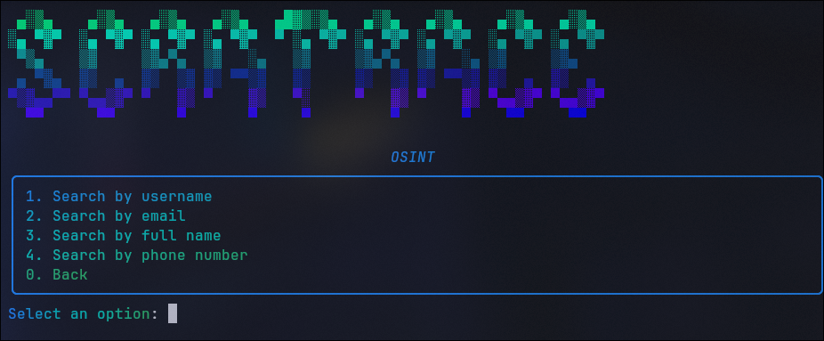

<div align="center">

[English](README.md) · [中文](README.zh.md) · [Русский](README.ru.md)


# scratrace

**An OSINT tool to find people by username, e-mail, phone number, and full name.**

Clean links. Playwright-powered. Multilingual.

[](https://www.python.org)
[](LICENSE)
[]()

</div>

---

## 🔍 What is it

`scratrace` is a console OSINT scanner that walks through a catalog of sites and
finds user profiles by a given identifier. Unlike most alternatives, we **never
report a hit at random**: every link in the catalog is verified for honesty, and
sites that lie are flagged and dropped.

### Supported search types

| Type               | Description                                          |
| ------------------ | ---------------------------------------------------- |
| 🧑 `username`      | Search by nickname across socials, forums, dev, etc. |
| 📧 `email`         | Search by e-mail · _coming soon_                       |
| 📱 `number_phone`  | Search by phone number · _coming soon_                |
| 👤 `full_name`     | Search by first and last name · _coming soon_         |

---

## ⚡ Why scratrace?

> Inspired by [Maigret](https://github.com/soxoj/maigret) — a mature OSINT tool with
> 3000+ sites and a clever double-check mechanism (claimed vs unclaimed username).
> We share the same goal but took a different path.

### 1. SQLite instead of JSON — lean & typed

Most OSINT tools store their 3000+ sites in a **44k-line JSON file** (`data.json`, 1.4MB).
That works, but:

- no schema — every field is just a string
- the entire JSON must be loaded into memory at once
- no indexing — finding a site means scanning the whole dict

We use **SQLite** (`SiteRegistry.db`, 536KB). Every column is typed
(`int`, `str`, `JSON`, `bool`), we can `SELECT`, `UPDATE`, `DELETE` with precision,
and the DB stays fast regardless of size.

### 2. Playwright for SPA & antibot sites

We run **real browser scripts** via Playwright for TikTok, Replit, Weebly,
Wix, Fiverr, LiveJournal and more.

### 3. Dorking built in

Beyond the site catalog, we automatically search DuckDuckGo via Playwright
for the username and show fresh web results under "Other Info".
No API key, no captcha.

### 4. Beautiful, friendly interface

A gradient menu, live progress bar with percentage, growing results feed
with color-coded categories. Built on [`rich`](https://github.com/Textualize/rich).

<div align="center">



</div>

### 5. Multilingual

Built-in i18n. Switch languages on the fly in Settings:

| Language   | Code |
| ---------- | ---- |
| 🇷🇺 Русский | `ru` |
| 🇬🇧 English | `en` |
| 🇨🇳 中文    | `cn` |

### 6. Speed

pyscratrace is fast. A typical username search takes ~15-30 seconds.

---

## 🚀 Installation

> **License change:** scratrace was previously under GPL v3. As of v0.2.2 it is now MIT licensed.

```bash
pip install git+https://github.com/0xScodyx/scratrace.git
```

Or a specific tagged version:

```bash
pip install git+https://github.com/0xScodyx/scratrace.git@v0.2.2
```

### Browser support (optional)

For Playwright-based browser checks and DuckDuckGo dorking, install the extra dependency and the browser:

```bash
pip install "scratrace[browser] @ git+https://github.com/0xScodyx/scratrace.git"
playwright install chromium
```

If you already have the base package and want to add browser support later:

```bash
pip install playwright playwright-stealth
playwright install chromium
```

### Development (editable mode)

```bash
git clone https://github.com/0xScodyx/scratrace.git
cd scratrace
pip install -e .
```

## 💻 Usage

```bash
pyscratrace          # interactive menu
```

Pick a search type (`username` / `email` / `phone` / `full_name`), enter a value,
and watch the live progress. Press `Enter` when done.

### Programmatic use

```python
from scratrace.osint import UserName

results = UserName("scodyx").check_all()
# -> {'social': [...], 'forums': [...], 'gaming': [...], ...}
```

### View logs

```bash
scratrace-log        # tail the latest search log
```

---

## 🧪 Testing

```bash
pytest
```

---

## 🗂 Structure

```
src/scratrace/
├── app.py               # interactive menu (rich)
├── ui.py                # gradients, tables, progress
├── i18n.py / lang.json  # translations
├── banner.py
├── log_view.py          # CLI viewer for scratrace.log
└── osint/
    ├── sites.py         # site registry + DB-backed catalog
    ├── username.py      # username check (all strategies)
    ├── pw_scripts.py    # Playwright profile & dork scripts
    ├── log.py           # ANSI-colored logging
    ├── email.py
    ├── number_phone.py
    └── full_name.py
tests/
├── test_sites.py        # reachability (do not touch!)
├── test_username.py     # OSINT behavioural checks
└── conftest.py
```

---

## 👥 Contributors

Thanks to everyone making `scratrace` cleaner and more accurate:

<!-- contrib.rocks: contributor avatars are pulled from the GitHub API automatically -->
<a href="https://github.com/0xScodyx/scratrace/graphs/contributors">
  
</a>

> Want to show up here? Add a site to `sites.py` or improve the check — PRs welcome!

---

## 🤝 Contributing

All PRs and commits must go to the `dev` branch only. The `main` branch is reserved for stable releases. Don't merge to `main` directly — open a PR against `dev` instead.

---

## 📜 License

MIT © scratrace contributors
